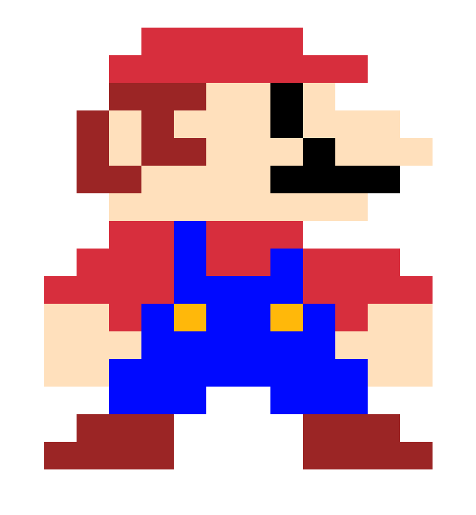
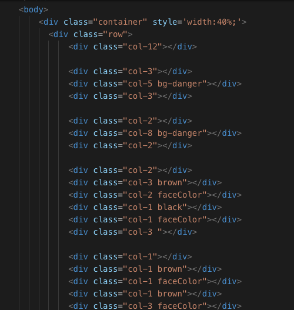

<h1>HTML Exercise</h1>
This repository is my HTML assignments in DigitalCrafts.
Here are some of the works that I enjoyed.

<h3>Pixel Art</h5>
I made pixel art using Bootstrap4. I have never imagine that we could recreate Mario with html and it was eye opening and fun!
<h5>Screen shot</h5> 

<h5>Code Snippet</h5> 

