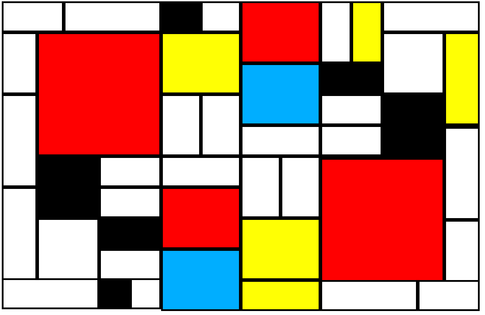
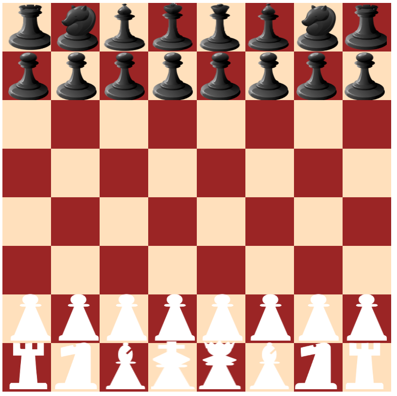

<h1>HTML Exercise</h1>
This repo is consited of my HTML/Flexbox/Bootsrap assigments in DigitalCrafts. 
Here are some of my favorite assignments.

<h3>Mosaic</h3>

The main object of this project is to learn about Flexbox. This assingment was before we were introduced to Bootstrap, and it was very challenging, but very rewarding after this is finally completed!
<a href='https://github.com/hirosoft40/html_exercises/tree/master/assignments/mosaic'>Github Link</a>

<h5>Screenshot</h5> 

<h3>Chess Board</h3>

I have replicated Chess Board using flexbox. After finishing Mosaic homework, I felt this was so much easier.

<a href='https://github.com/hirosoft40/html_exercises/tree/master/assignments/chess'>Github Link</a>

<h5>Screenshot</h5> 

<h3>Pixel Art</h3>

I have never imagined that we could recreate Mario with html and it was eye opening and fun!
<a href='https://github.com/hirosoft40/html_exercises/blob/master/assignments/bootstrap_ex/pixelArt.html'>Github Link</a>

<h5>Screen shot</h5> 

